 

# Projeto: Dictionary - Find your words
#### *This a challenge by Coodesh*

Este projeto consiste em um aplicativo móvel desenvolvido com o objetivo de listar e gerenciar palavras em inglês, utilizando a API Free Dictionary API como fonte de dados. O aplicativo oferece uma experiência de usuário intuitiva para buscar, visualizar e gerenciar palavras em inglês, tornando-o uma ferramenta útil para estudantes e entusiastas da língua inglesa.

## Recursos e Funcionalidades:

O aplicativo possui várias funcionalidades que facilitam a exploração e o gerenciamento de palavras em inglês:

### Listagem de Palavras:
A página principal do aplicativo exibe uma lista de palavras em inglês, que é carregada a partir da API Free Dictionary API.
Cada palavra é apresentada como um item da lista, tornando fácil a visualização.
<div align="center">
  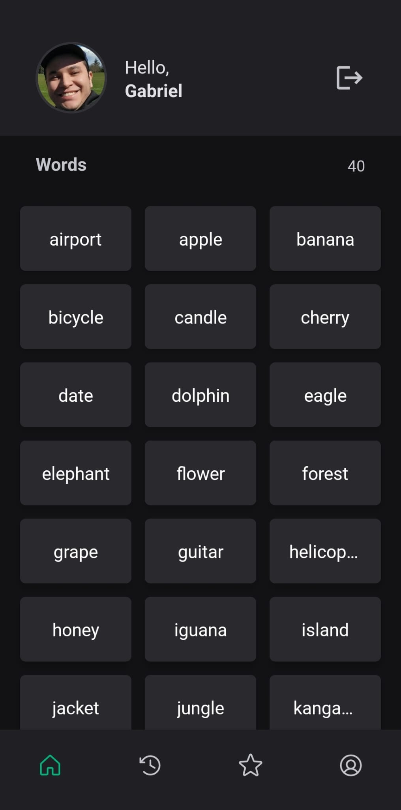
</div>

### Detalhes da Palavra:
Ao tocar em uma palavra da lista, o usuário pode acessar os detalhes da palavra.
Os detalhes incluem informações como a pronúncia fonética da palavra, significados associados a ela e exemplos de uso.
<div align="center">
  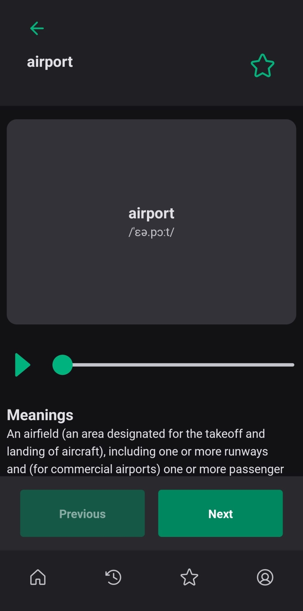
  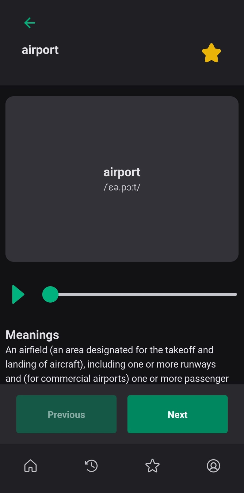
</div>

### Reprodução de Áudio:
O aplicativo permite aos usuários ouvir a pronúncia correta da palavra, fornecendo uma função de reprodução de áudio para as palavras que possuem áudio disponível.
<div align="center">
  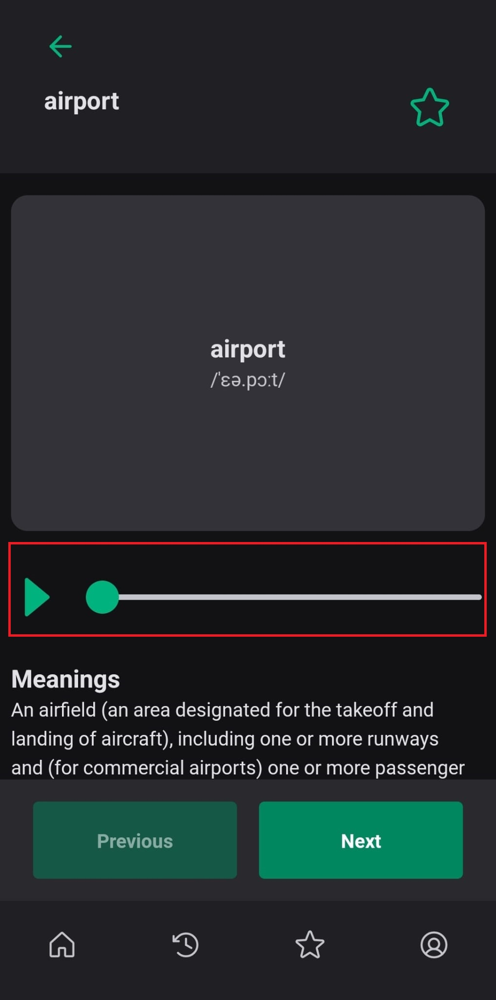
</div>

### Marcação como Favorita:
Os usuários podem marcar palavras como favoritas para acesso rápido posteriormente.
Um ícone de estrela indica se uma palavra é favorita ou não.
<div align="center">
  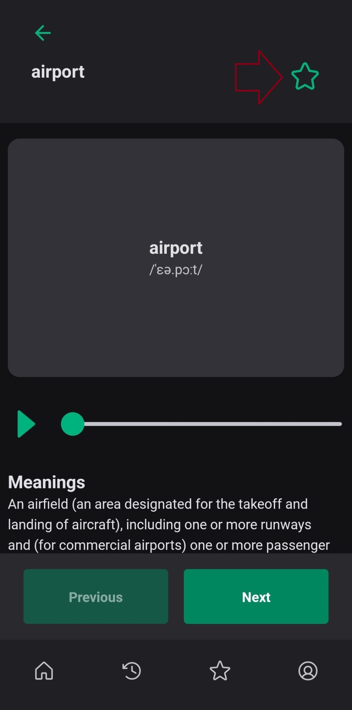
  
</div>

### Histórico de Palavras Visualizadas:
O aplicativo mantém um histórico das palavras que o usuário visualizou recentemente.
<div align="center">
  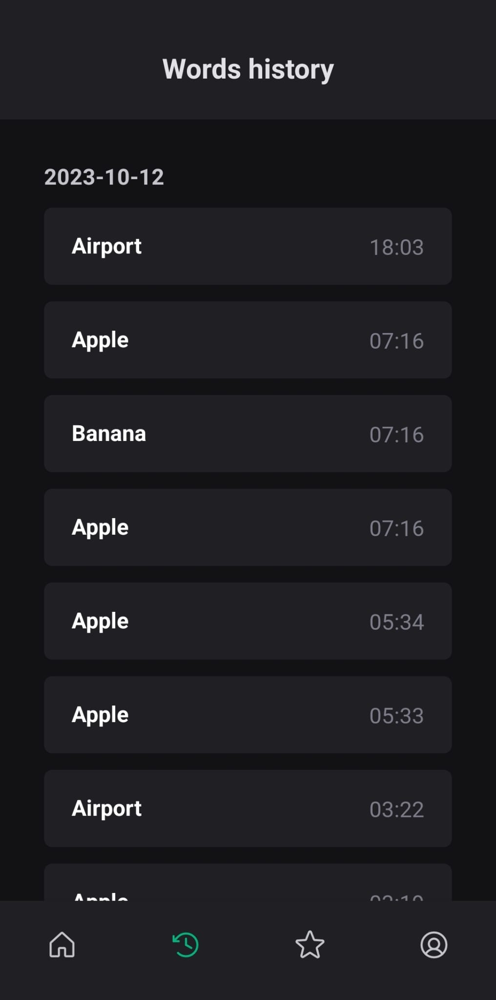
</div>

### Navegação entre Palavras:
Os usuários podem navegar para a próxima palavra ou voltar para a palavra anterior, tornando a exploração contínua e fluida.
<div align="center">
  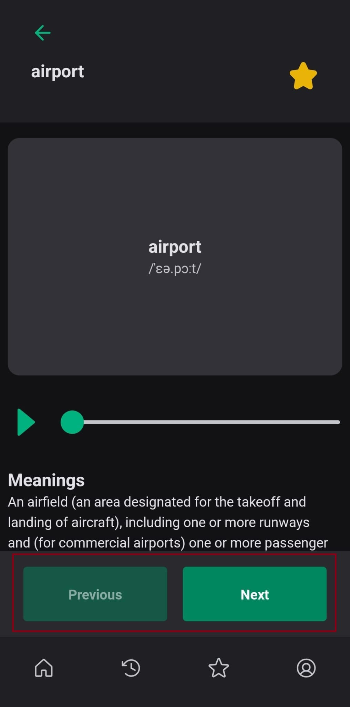
</div>

### Carregamento de Mais Palavras:
À medida que o usuário rola a lista de palavras, o aplicativo carrega mais palavras para permitir a exploração contínua.
<div align="center">
  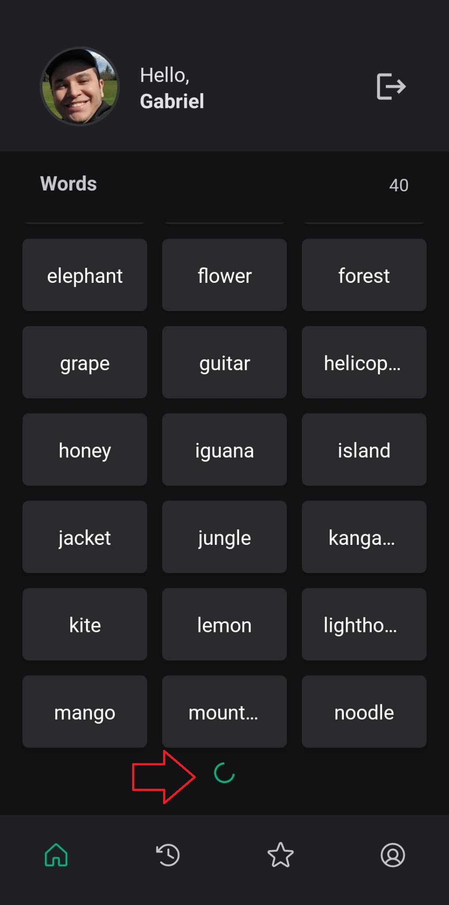
</div>

### Gerenciamento de Favoritos:
Os usuários podem gerenciar suas palavras favoritas, adicionando ou removendo itens da lista de favoritos.
<div align="center">
  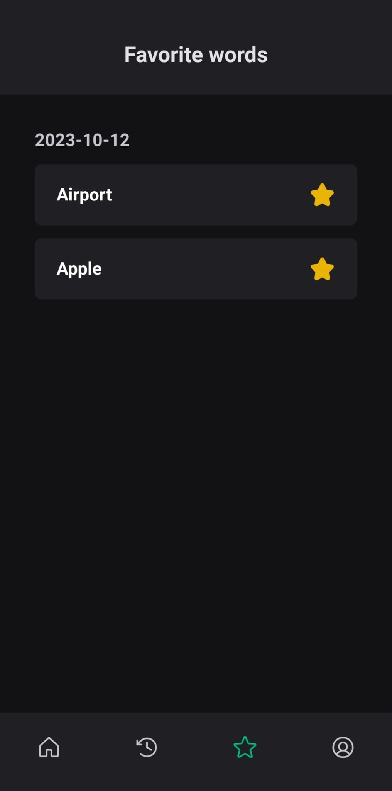
</div>

### Tela de Login:
Os usuários podem fazer login em suas contas para acessar recursos personalizados e sincronizar dados entre dispositivos.
A tela de login requer autenticação, garantindo a segurança das contas de usuário.
<div align="center">
  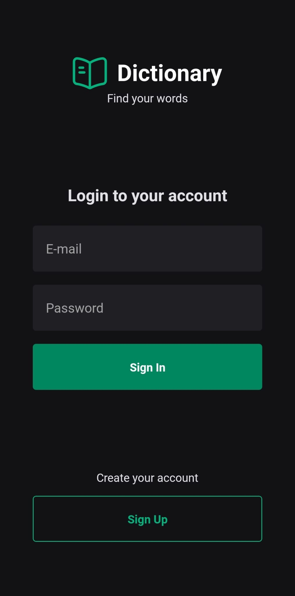
</div>

### Tela de Cadastro:
Os novos usuários podem criar contas no aplicativo por meio da tela de cadastro.
O cadastro requer informações básicas, como nome de usuário, senha e endereço de e-mail. Há também uma validação para garantir que o usuário insira no mínimo 6 caracteres para aumentar a segura de acesso.
<div align="center">
  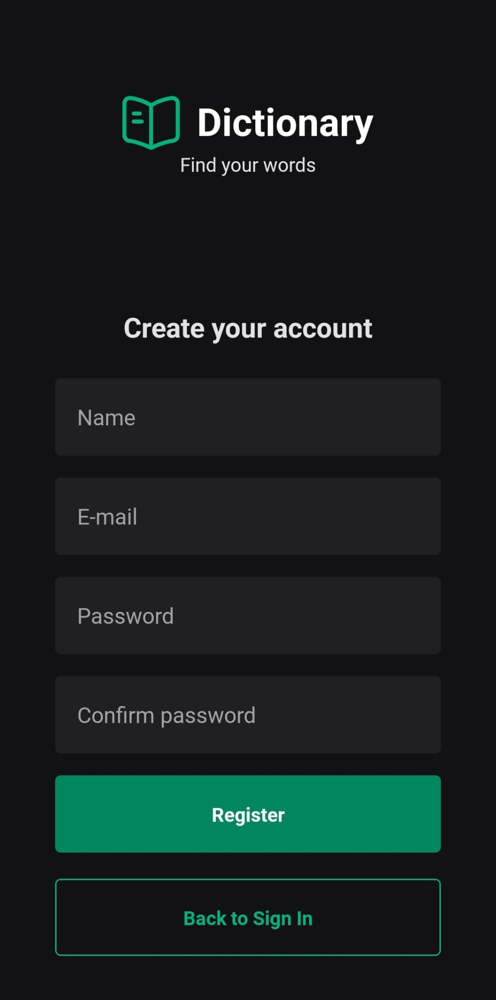
</div>

### Tela de Perfil:
A tela de perfil permite aos usuários gerenciar suas informações pessoais e configurações de conta.
Os usuários podem trocar sua foto de perfil e atualizar sua senha com segurança.
<div align="center">
  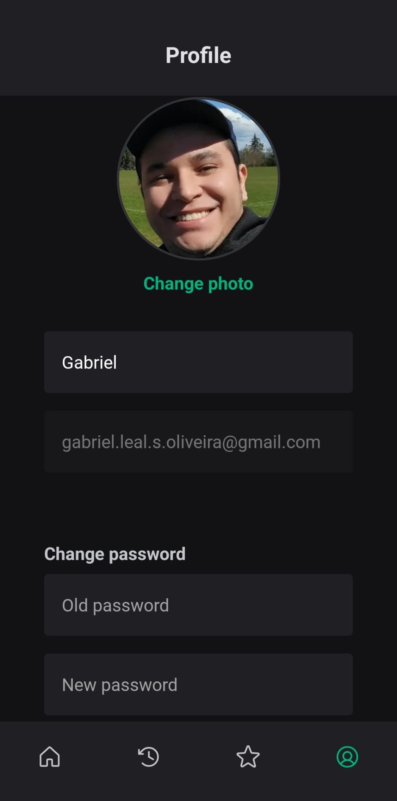
  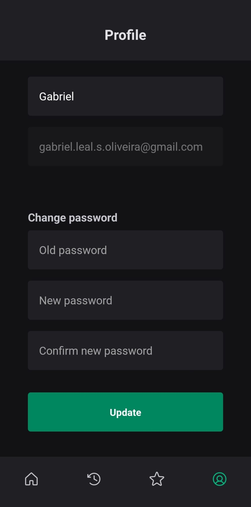
</div>


## Tecnologias Utilizadas (Backend)
  O backend deste projeto, nomeado "api", foi desenvolvido como parte do módulo de consumo de API, apresentado como um desafio pela Coodesh. Abaixo estão as tecnologias e bibliotecas essenciais utilizadas:

### Frameworks & Libraries:

**Express (v4.18.1):** Utilizado como o framework web principal para criar e gerenciar rotas, middlewares e a lógica do servidor.
**Knex (v2.2.0):** Uma query builder para JavaScript, suportando diversas bases de dados. Utilizado para gerenciar migrações, seeds e operações de banco de dados.
**SQLite3 (v5.0.11):** Banco de dados SQL embutido, escolhido pela sua simplicidade e capacidade de funcionar sem um servidor de banco de dados separado.

### Autenticação & Segurança:

**bcryptjs (v2.4.3):** Utilizado para hashing de senhas, garantindo a segurança dos dados dos usuários.
**jsonwebtoken (v8.5.1):** Empregado para a geração de tokens JWT, garantindo autenticação e autorização seguras para rotas específicas.

### Utilitários:
**dayjs (v1.11.5):** Biblioteca leve para manipulação e formatação de datas.
**uuid (v9.0.0):** Para geração de identificadores únicos.
**multer (v1.4.5-lts.1):** Middleware para lidar com o upload de arquivos.
**cors (v2.8.5):** Para permitir o controle de acesso de origem cruzada, tornando a API acessível para diferentes domínios.
**express-async-errors (v3.1.1):** Para um tratamento mais simples e eficaz de erros assíncronos em rotas Express.
**swagger-ui-express (v4.5.0):** Para documentação da API, permitindo uma visualização interativa das rotas, parâmetros e respostas.

## Tecnologias Utilizadas (Frontend)
- **Linguagem:** JavaScript
- **Framework:** React Native
- **Biblioteca de Navegação:** React Navigation
- **Biblioteca de Requisições:** Axios
- **Biblioteca de Formulários:** React Hook Form
- **Biblioteca de Estilização:** Native Base

### Dependências
- @expo-google-fonts
- Async Storage
- Axios
- Expo
- Native Base
- React Hook Form
- React Navigation
- Yup (para validações)
... e muitas outras bibliotecas para auxiliar no desenvolvimento e garantir a melhor experiência do usuário.

## Como instalar e rodar o projeto Dictionary (Backend)

### 1. Preparação do Ambiente:
Certifique-se de ter o Node.js e o NPM instalados no seu computador. Você pode verificar isso executando node -v e npm -v no terminal.
### 2. Clonando o Repositório:
- Clone o repositório do projeto para sua máquina local usando:

    ```
  $ git clone [URL_DO_REPOSITÓRIO]
    ```

- Navegue até o diretório do projeto:
  
  ```
  $ cd backend
  ```

### 3. Instalando Dependências:
- Instale todas as dependências necessárias do projeto usando:

   ```
  $ npm install
   ```

### 4. Executando o Servidor em Modo de Desenvolvimento:
- Inicie o servidor em modo de desenvolvimento com:

   ```
  $ npm run dev
   ```
  
- O Nodemon irá monitorar mudanças nos arquivos e reiniciar o servidor automaticamente.

### 5. Verificando a API:
Com o servidor rodando, você pode acessar ```http://localhost:PORTA``` em seu navegador ou usando ferramentas como o Postman para testar os endpoints da API.

### 7. Documentação da API:
Se você integrou o swagger-ui-express para documentação da API, é possível que haja um endpoint dedicado (como /api-docs) para visualizar a documentação interativa.

## Como instalar e rodar o projeto Dictionary (Frontend)

### Pré-requisitos
Tenha o Node.js instalado em sua máquina.
Tenha o Expo CLI instalado globalmente usando npm install -g expo-cli.

### Passo a passo

#### 1. Preparação do Ambiente:
- Certifique-se de ter o Node.js e o NPM/Yarn instalados no seu computador. Você pode verificar isso executando node -v e npm -v ou yarn -v no terminal.
- Instale o Expo CLI globalmente executando:

```
npm install -g expo-cli
```
#### 2. Clonando o Repositório:
- Clone o repositório do projeto para sua máquina local usando:

```
git clone [URL_DO_REPOSITÓRIO]
```
#### 3. Instalando Dependências:
- Instale todas as dependências necessárias do projeto usando:

```
npm install
```
#### 4. Iniciando o Servidor Expo:
- Inicie o servidor Expo com:
- Isso abrirá uma nova janela no seu navegador padrão com um QR code.

```
expo start
```

#### 5. Rodando no Dispositivo:
- Instale o aplicativo Expo Go no seu dispositivo móvel (disponível na App Store ou Google Play).
- Escaneie o QR code exibido no seu navegador com o aplicativo Expo Go.
- O projeto será carregado e exibido no seu dispositivo.

#### 6. Opções de Emulação:
Se você tiver um emulador Android/iOS instalado, poderá também executar o projeto diretamente no emulador. Após iniciar o servidor Expo (passo 4), pressione a para Android ou i para iOS no terminal para iniciar o emulador correspondente.

### 7. Conclusão:

O projeto agora deve estar rodando no seu dispositivo ou emulador. Explore e teste as funcionalidades conforme necessário!

**Dica:** Sempre verifique se o backend ou quaisquer serviços dependentes estão ativos e funcionando corretamente, especialmente se estiver enfrentando problemas ao tentar rodar o frontend.

## Estrutura da aplicação: 

### Descricao do projeto (Backend)

Utilizei o Swagger para documentar o backend do projeto, proporcionando uma interface visual clara e interativa. Através do Swagger, foi possível definir, descrever e visualizar todos os endpoints da API de forma padronizada, facilitando o entendimento e a integração por parte dos desenvolvedores. 
Rodar a aplicacao e colar na URL do navegador o seguinte link

```
http://localhost:3333/api-docs/#/User/post_users
```
## Descrição do projeto (Frontend)

### Componentes:

#### Button.tsx:
Um botão personalizado construído com base no native-base.
Oferece duas variantes: sólido e contorno.
O texto no botão é passado através da propriedade title.
Suporta todas as outras propriedades do botão do native-base.

#### Input.tsx:
Um campo de entrada personalizado que estende o Input do native-base.
Adiciona a funcionalidade para exibir mensagens de erro.
Se uma mensagem de erro for fornecida, a borda da entrada fica vermelha e a mensagem é exibida abaixo do campo.

#### ListaCard.tsx:
Um componente que exibe palavras do histórico ou favoritos do usuário.
Mostra a palavra à esquerda e, à direita, ou o horário em que a palavra foi adicionada ao histórico ou um ícone de estrela para favoritos.
O conteúdo exibido à direita é determinado pela propriedade content.

#### Loading.tsx:
Um simples componente de carregamento que centraliza um ícone de spinner em um fundo cinza.

#### Screen.tsx:
Representa um cabeçalho para uma tela.
Centraliza o título fornecido no meio de um fundo colorido.

#### UserPhoto.tsx:
Um componente que representa imagens circulares ideais para fotos de perfil de usuário ou avatares.
O tamanho da imagem é personalizável e garante uma forma circular com uma borda.

#### HomeHeader.tsx:
Exibe a foto do usuário, uma mensagem de saudação e um botão de logout.
Recupera os dados do usuário autenticado do hook useAuth.
Se o usuário não tiver um avatar, uma imagem padrão é utilizada.

#### WordList.tsx
É um componente React Native projetado para exibir palavras em cards individuais e tocáveis. Estes cards ajustam-se dinamicamente à largura da tela, alinhando-se para mostrar três por linha. Cada card tem um design cinza com texto em branco e bordas arredondadas. Palavras longas são elegantemente truncadas com reticências para manter a apresentação visual limpa.

### Telas:

#### Word.tsx
Este arquivo define uma tela interativa para exibir e interagir com detalhes de palavras, incluindo sua pronúncia e definição. A interação com o backend é feita para buscar detalhes da palavra, marcar como favorita e registrar o histórico de palavras visualizadas.

#### SignUp.tsx
É um componente de cadastro bastante abrangente com bom gerenciamento e validação de formulário. O uso de hooks (como useForm e useAuth) e utilitários (como o esquema Yup) torna o código limpo e gerenciável. Ele usa o react-hook-form para gerenciamento de formulário, que oferece benefícios como validação automática de formulário e fácil integração com bibliotecas externas de validação, como o Yup.

#### SignIn.tsx
É responsável por permitir que os usuários façam login na aplicação. Ele também oferece uma opção para navegar até a tela de cadastro.

#### Profile.tsx
É responsável por exibir e permitir que os usuários atualizem suas informações de perfil, incluindo a foto de perfil e a senha.

#### Home.tsx
É a tela principal de um aplicativo que mostra uma lista de palavras ao usuário. Ele utiliza o hook personalizado useAuth para obter informações do usuário e o AuthContext para buscar palavras. O componente oferece uma funcionalidade de paginação através do hook usePagination. Os usuários podem tocar em uma palavra para registrá-la em seu histórico e serem redirecionados para uma tela de detalhes. Durante o carregamento de mais palavras ou o registro de uma palavra, um indicador de carregamento (Spinner) é exibido.

#### History.tsx
Exibe o histórico de palavras do usuário em seções organizadas. Ele utiliza os hooks useAuth para obter informações do usuário e useHistory para buscar o histórico de palavras. Se estiver carregando o histórico, um componente de carregamento (Loading) é mostrado. Caso contrário, uma SectionList exibe as palavras em seções com cabeçalhos. Se não houver palavras no histórico, uma mensagem é mostrada ao usuário sugerindo que procure palavras na página principal. A tela também ajusta o posicionamento vertical do componente vazio com base na altura da janela do dispositivo.

#### Favorite.tsx
O componente Favorite exibe uma lista das palavras favoritas do usuário, organizadas em seções por data. Utiliza o hook useAuth para obter dados do usuário e faz uma chamada API para buscar suas palavras favoritas. O resultado é transformado usando a função transformData e apresentado em um SectionList

### Routes

#### index.tsx
Utiliza o tema do native-base e o NavigationContainer do @react-navigation/native para gerenciar as rotas.
Define as cores de fundo do tema do NavigationContainer baseado no tema do native-base.
Com base no estado do usuário autenticado obtido pelo hook useAuth, exibe AppRoutes se o usuário estiver autenticado ou AuthRoutes caso contrário.
Enquanto estiver carregando os dados do usuário do armazenamento, exibe o componente Loading.

#### AuthRoutes.tsx
Cria um conjunto de rotas usando createNativeStackNavigator do @react-navigation/native-stack.
Define tipos de rotas específicas para autenticação: signIn e signUp.
Exporta um tipo de propriedade de navegação para uso externo, baseado nos tipos de rotas definidos.
Dentro do componente, define duas telas (SignIn e SignUp) sem cabeçalhos e as renderiza dentro de um Navigator.

#### AppRoutes.tsx
Estabelece um conjunto de rotas usando o createBottomTabNavigator do @react-navigation/bottom-tabs.
Define tipos específicos para as rotas da aplicação: home, word, history, favorite e profile.
Exporta um tipo de propriedade de navegação para uso externo baseado nos tipos de rotas.
Utiliza ícones do pacote phosphor-react-native para representar cada rota na barra de tabs.
Usa um hook (useTabBarOptions) para definir a aparência da barra de tabs com base no tema da aplicação.
Implementa uma função (getTabBarIcon) para retornar o ícone apropriado para cada rota.
Dentro do componente AppRoutes, define as rotas da aplicação e suas respectivas telas, bem como configura os ícones da barra de tabs.

### Hooks

#### useAuth.tsx
Hook personalizado que fornece acesso ao AuthContext.
Utiliza o useContext para obter o valor corrente do AuthContext.
Facilita o acesso à lógica e aos dados de autenticação em qualquer parte da aplicação.

#### useHistory.ts
Hook personalizado para carregar o histórico de palavras de um usuário.
Mantém o estado do carregamento e o histórico das palavras em dois estados: isLoading e words.
Utiliza o hook useToast do native-base para exibir mensagens ao usuário.
Define a função transformData para transformar dados brutos de palavras em seções agrupadas por data.
Define a função fetchHistory para buscar os dados históricos de palavras da API, tratando possíveis erros e exibindo mensagens apropriadas.
Utiliza o hook useFocusEffect do @react-navigation/native para carregar o histórico sempre que o componente estiver em foco.
Retorna o estado de carregamento e os dados históricos das palavras.

#### usePagination.ts
Hook personalizado para gerenciar a paginação de uma lista de dados.
Inicialmente, exibe uma quantidade fixa de itens definida por INITIAL_ITEMS.
Permite carregar mais itens (definidos por LOAD_MORE_ITEMS) à medida que o usuário rola a lista.
Introduz um atraso artificial (DATA_LOAD_DELAY) ao carregar mais itens para simular um carregamento de dados.
Mantém os estados:
visibleData: dados atualmente visíveis.
loadingMore: se está carregando mais dados no momento.
scrollOffset: a posição atual de rolagem.
allDataLoaded: se todos os dados foram carregados.
Define a função handleLoadMoreData que gerencia o carregamento de mais itens quando acionada.
Retorna os estados e funções que podem ser usados ​​por componentes que desejam implementar a paginação.
Esse resumo oferece uma visão geral do que o hook faz e suas principais funcionalidades.

### Services

#### api.ts

#### *axiosInstance:*

- Instância customizada do Axios para se comunicar com o backend da aplicação.
- Possui um interceptor para gerenciar a renovação automática de tokens de autenticação. Quando o token está expirado ou inválido, tenta obter um novo token e reenviar a requisição.
- Se o token de atualização (refresh_token) não estiver disponível ou o processo de renovação falhar, o usuário será desconectado.
- As requisições que falham devido a tokens expirados são enfileiradas e reenviadas após a obtenção de um novo token.
dictionaryApi:

Instância Axios para uma API externa de dicionário.
#### *api:*

- Objeto que agrupa várias chamadas à API, incluindo:
- Registro de usuário (signUp).
- Autenticação de usuário (signIn).
- Obter palavras (getWords).
- Atualizar palavra como favorita (sendFavoriteUpdate).
- Registrar pesquisa de palavra no histórico do usuário (sendHistory).
- Recuperar histórico de pesquisa de palavras do usuário (getHistory).
- Recuperar palavras favoritas do usuário (getFavorites).
- Atualizar informações pessoais do usuário (updateUsers).
- Atualizar avatar do usuário (updateAvatar).
- Obter um novo token usando o refresh_token (requestToken).

### Storage

#### storageAuthToken.ts

 #### *Funções de Armazenamento para Tokens de Autenticação:*
Este módulo oferece funções para interagir com o AsyncStorage (uma solução de armazenamento local no React Native), especificamente para gerenciar o token JWT do usuário e seu token de atualização associado.

#### *Tipos:*

StorageAuthTokenProps: Um tipo que define a estrutura para salvar e recuperar tokens relacionados à autenticação do AsyncStorage.
Funções:

##### storageAuthTokenSave({ token, refresh_token }):

- Salva os token e refresh_token fornecidos no AsyncStorage.
- Eles são armazenados sob uma chave nomeada pela constante AUTH_TOKEN_STORAGE.

##### storageAuthTokenGet():

- Recupera o token e refresh_token armazenados do AsyncStorage.
- Se não houver dados no AsyncStorage, ele retorna um objeto vazio.
- Caso contrário, retorna um objeto contendo ambos, o token e o refresh_token.

##### storageAuthTokenRemove():

- Exclui o token e refresh_token do AsyncStorage.

#### storageConfig.ts

Fornece constantes para chaves de armazenamento usadas no AsyncStorage:

**USER_STORAGE:** Chave para dados do usuário.
**AUTH_TOKEN_STORAGE:** Chave para tokens de autenticação.

Utilizadas para identificar e gerenciar dados salvos no armazenamento local do projeto "Dicionário".

#### storageUser.ts

Gerencia os dados do usuário no AsyncStorage:

- **storageUserSave:** Salva os dados do usuário.
- **storageUserGet:** Recupera os dados do usuário.
- **storageUserRemove:** Remove os dados do usuário.

Este módulo utiliza a chave **USER_STORAGE** para identificar os dados do usuário no armazenamento local

### Contexts

#### AuthContext.tsx

Fornece funções e estados relacionados à autenticação e perfil do usuário:

**AuthContext:** Contexto que armazena e disponibiliza dados e funções relacionados à autenticação.
**AuthContextProvider:** Componente provedor do contexto.
**signIn:** Função para autenticar o usuário, salvar tokens e atualizar estados.
**signOut:** Função para deslogar o usuário e remover dados de armazenamento local.
**updateUserProfile:** Atualiza o perfil do usuário no estado e no armazenamento.
**fetchWords:** Busca palavras do servidor com tratamento de erros.
**loadUserData:** Carrega dados do usuário e token do armazenamento local no início.

Este módulo também gerencia interceptores para lidar com a gestão de tokens e utiliza efeitos para carregar dados do usuário quando o componente é montado.

### dtos

#### HistoryByDayDTO.tsx
**Section:** Representa a estrutura geral de uma seção com título e dados associados.
**Word:** Representa uma entidade de palavra com seus atributos:
**id:** Identificador único para a palavra.
**word:** Conteúdo real da palavra.
**created_at:** Data e hora da criação da palavra.
**HistoryByDayDTO:** Representa os dados da palavra agrupados por dia para fins históricos. Contém o dia e a lista de palavras criadas naquele dia.

#### HistoryDTO.tsx
Representa uma entrada no histórico de palavras do usuário:

**id:** Identificador único para a entrada do histórico.
**word:** A palavra que foi pesquisada ou salva.
**created_at:** Data e hora da adição da entrada ao histórico.

#### UserDTO.tsx
Representa os detalhes de um usuário na aplicação:

**id:** Identificador único do usuário.
**name:** Nome completo do usuário.
**email:** Endereço de email do usuário, geralmente usado para login.
**avatar:** Link ou referência para a foto de perfil do usuário.

### utils

#### transformData.ts
Função que transforma um array de objetos OriginalWord em um array de objetos TransformedData. A transformação agrupa palavras por data e atribui IDs sequenciais a cada palavra.

#### AppError.ts
Classe de erro personalizado para gerenciar erros na aplicação:

**message:** Propriedade para armazenar a mensagem de erro.
**constructor:** Método para inicializar a mensagem de erro.


## Conclusão

Desenvolvi um app para listar e favoritar palavras em inglês usando a API Free Dictionary. Meu objetivo foi fazer algo fácil de usar e bonito visualmente.
Usei várias ferramentas modernas para criar o app. Além das funções básicas, como ver e favoritar palavras, adicionei algumas coisas extras, como um tocador de áudio.
Documentei todo o trabalho de programação para que outras pessoas possam entender facilmente o que fiz. Também fiz um vídeo explicando o projeto.
Resumindo, estou bem feliz com o resultado. Aprendi muito e estou curioso para saber o feedback sobre o meu trabalho!

